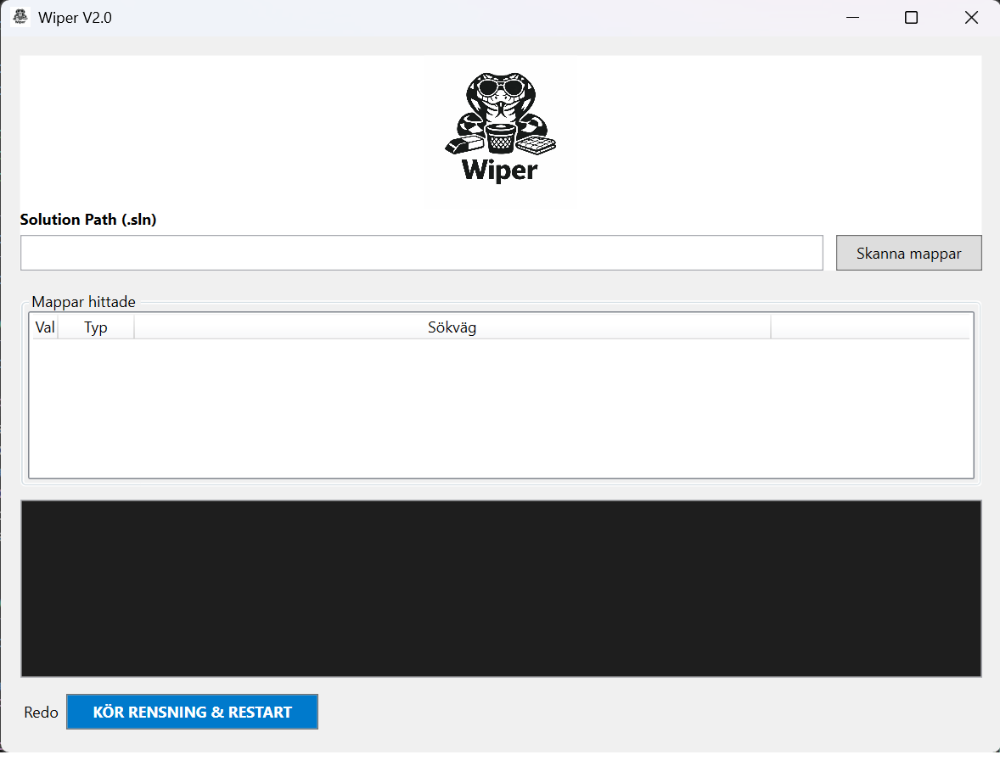

# Wiper

**Wiper** is a lightweight Windows WPF application designed to clean up Visual Studio solutions. It automates the removal of `bin` and `obj` folders, saves all files, and optionally restarts Visual Studio, providing a faster way to reset project builds.

## Features

* Scan a Visual Studio solution for `bin` and `obj` folders.
* Only targets folders inside projects containing a `.csproj` file to prevent accidental deletion.
* Delete selected folders safely with logging.
* Save all files in the solution before cleaning.
* Optionally restart Visual Studio after cleanup.
* Real-time logging of operations in the UI.
* Simple, user-friendly interface built with WPF.

## Installation

1. Clone the repository:

```bash
git clone https://github.com/yourusername/Wiper.wpf.git
```

2. Open the solution in Visual Studio (requires Visual Studio 2022 or later).
3. Build the solution using `Debug` or `Release` configuration.
4. The executable will be available in the `bin\Debug\net9.0-windows` or `bin\Release\net9.0-windows` folder.

## Usage

1. Open Wiper.exe.
2. Enter the path to your `.sln` file in the “Solution Path” field.
3. Click **Scan Folders** to list all `bin` and `obj` folders inside the solution.
4. Select the folders you want to delete.
5. Click **Run Clean & Restart** to:

   * Save all files in Visual Studio.
   * Delete selected folders.
   * Restart Visual Studio automatically (optional).
6. Monitor the process in the log panel.

## Screenshot

Here is a screenshot of Wiper in action:



## Safety

* Only `bin` and `obj` folders are deleted.
* Folders are verified to belong to a project containing a `.csproj` file.
* User confirmation is required before deletion and restarting Visual Studio.

## Contributing

Contributions are welcome. Please open an issue or pull request with improvements, bug fixes, or suggestions.

## Requirements

* Windows 10 or later
* .NET 9.0 (Windows)
* Visual Studio 2022 or later (for interacting with DTE/solution cleanup)

## License

This project is licensed under the MIT License. See the [LICENSE](LICENSE) file for details.

